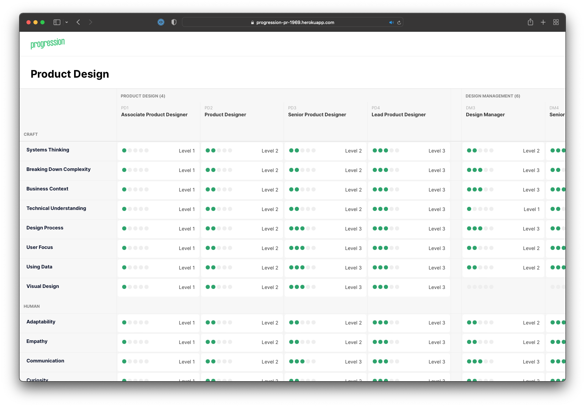

 
 

  
<h3 align="center">Frontend Technical Challenge</h3>
 
 

Thanks for taking a look at our Frontend Technical Challenge! Please read this document before writing any code 🧑‍💻

## 👉 Brief

One of the most important pages in our application is the Framework page—it brings together everything you need to
understand what skills are required at every role in your organisation.

At the moment, this page is built using old-school Rails views and jQuery. We need to rebuild this page in React, so we
can make it quicker, more responsive and so that it's easier to add more features.

Here's a lightweight version of the framework page we use in our real production app:

  

We need you to kick this off for us! Take a look at the tasks below, and make sure to read the notes before starting.

#### Notes

- Please treat this as if you were really pairing, so feel free to email us with questions and use google.
- High quality work is important to us, treat this as if it was going to Production.
- Don't worry about finishing! We'd prefer to see how you work than get everything done. **Please don't spend an
excessive amount of time on this task—anywhere between 2 and 4 hours is plenty**—feel free to make a note of anything
you would do if you had more time.
- Feel free to use the screenshot above as inspiration, rather than recreate it exactly.
- If some instructions are a little vague, take it as an invitation to use your imagination and best judgement.
- We're leaving technology choices up to you! Feel free to use libraries or frameworks that you think can help you get.
the work done quickly and to a high quality.

#### 1️⃣ &nbsp;Task 1
Show a basic list of skills, grouped by their category. You can use the data in [`skills.json`](./data/skills.json) to
help you.

#### 2️⃣ &nbsp;Task 2
Create a row of positions, grouped by their discipline. You can use the data in
[`positions.json`](./data/positions.json) to help you.

#### 3️⃣ &nbsp;Task 3
Fill in the table of requirements, where each requirement is the link between a skill and a position. You can use the
data in [`requirements.json`](./data/requirements.json) to help you.

#### 4️⃣ &nbsp;Task 4
Create the interaction which allows a user to create a new requirement for a given skill and position, where there isn't
already a requirement present. As well as choosing the position and skill, the user will need to choose a skill level
for the requirement.
